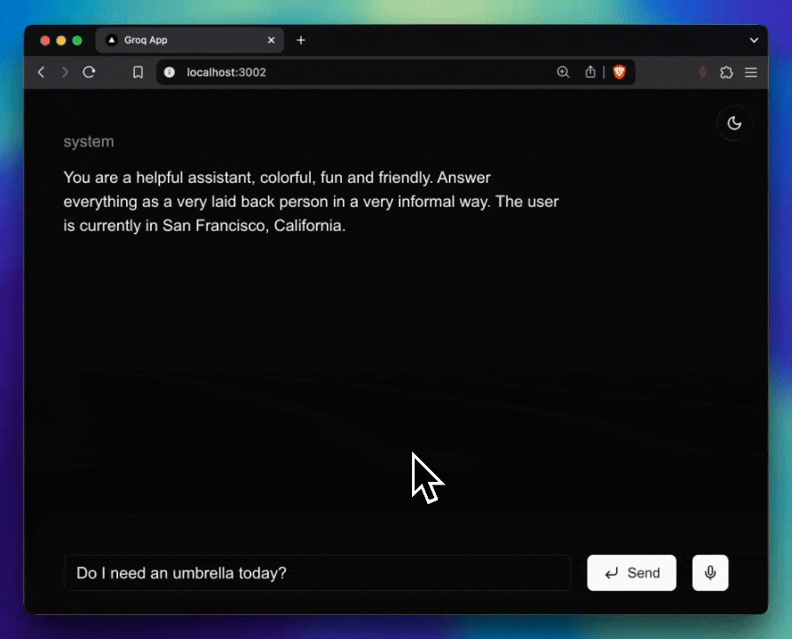

# groq-frontend-base

[](LICENSE)  

> **A Next.js template that integrates Groq API, Tailwind CSS, ShadCN UI, and a chat completion feature with both server-side and client-side components.**  




This repository serves as a **base project** for creating a frontend application that communicates with the Groq API. It's pre-configured with a modern stack to help you get up and running quickly.

---

## Table of Contents

- [groq-frontend-base](#groq-frontend-base)
  - [Table of Contents](#table-of-contents)
  - [Features](#features)
  - [Getting Started](#getting-started)
    - [1. Clone or Use This Template](#1-clone-or-use-this-template)
    - [2. Install Dependencies](#2-install-dependencies)
    - [3. Set Up Environment Variables](#3-set-up-environment-variables)
    - [4. Run the Development Server](#4-run-the-development-server)
    - [5. Customize for your project](#5-customize-for-your-project)
  - [Project Structure](#project-structure)
  - [Environment Variables](#environment-variables)
  - [Development Workflow](#development-workflow)
  - [Contributing](#contributing)
  - [License](#license)

---

## Features

- **Next.js (TypeScript)** – A popular React framework for production-grade apps.
- **Tailwind CSS** – Utility-first CSS framework for rapid UI development.
- **ShadCN UI** – A design system built on top of Radix UI and Tailwind.
- **Biome.js** – For code formatting, linting, and general code quality improvements.
- **Server-side Chat Completion** – Use the Groq API for server-side chat logic.
- **Client-side Chat Hook** – A React hook to handle client-side chat completion logic.

---

## Getting Started

### 1. Clone or Use This Template

You can clone the repository:

```bash
git clone https://github.com/your-username/groq-frontend-base.git
cd groq-frontend-base
```

Or click the **“Use this template”** button on GitHub to create a new repository from this template.

### 2. Install Dependencies

This project uses [pnpm](https://pnpm.io/). To install dependencies:

```bash
pnpm install
```

### 3. Set Up Environment Variables

Create a file named `.env.local` in the project root. Include your **Groq API key**:

```bash
# GROQ_API_KEY must be secret and not shared.
GROQ_API_KEY=your_api_key
```

### 4. Run the Development Server

```bash
pnpm dev
```

The app will be available at [http://localhost:3000](http://localhost:3000).

### 5. Customize for your project

- Start your journey at `src/app/page.tsx`.
- Customize the prompts or tools as needed.
- Take a quick look at how `src/app/components/chat-component.tsx` is implemented.
- Use the hooks in `src/hooks/use-completion.ts` and `src/hooks/use-completion-tools.ts` to customize the chat completion logic.
- Have fun!

*(Adjust as needed if you’re deploying to a service like Vercel or Netlify.)*

---

## Project Structure

A quick look at the top-level files and directories you’ll see in this project:

```
.
├── public/                # Static assets
├── src/                   
│   ├── app/               # Next.js App Router
│   │     ├── api/         # Implements Groq-API server-side chat completion
│   │     └── page.tsx     # Uses the chat completion hook
│   ├── components/        # Shared components
│   ├── hooks/             # React hooks (including chat completion hook)
│   ├── lib/               # Basic utility functions
│   └── providers/         # Providers folder. Includes theme-provider
├── .env.local             # Environment variables (not committed)
└── (config files)
```

---

## Environment Variables

The project expects the following environment variable in `.env.local`:

```bash
GROQ_API_KEY=your_api_key_here
```

- **GROQ_API_KEY**: Used to authenticate requests to the Groq API. Make sure not to commit this key to a public repository.

---

## Development Workflow

1. **Pull requests**: Open a PR for any feature or fix.  
2. **Lint & format**: This project uses Biome.js, which can be run via `pnpm biome lint`.  
3. **Commits**: Use clear commit messages (e.g., [Conventional Commits](https://www.conventionalcommits.org/)) if preferred.  

---

## Contributing

Contributions are welcome! Please open issues for feature requests or bug reports.  
1. Fork this repository  
2. Create a new branch for your feature/fix  
3. Commit your changes  
4. Open a pull request against the `main` branch  

For major changes, please discuss with the maintainers via GitHub issues first to ensure they align with the project roadmap.

---

## License

This project is licensed under the [MIT License](LICENSE). You’re free to use and modify this code for your own purposes.  

---

*Happy coding! If you have any questions or feedback, feel free to open an issue.*